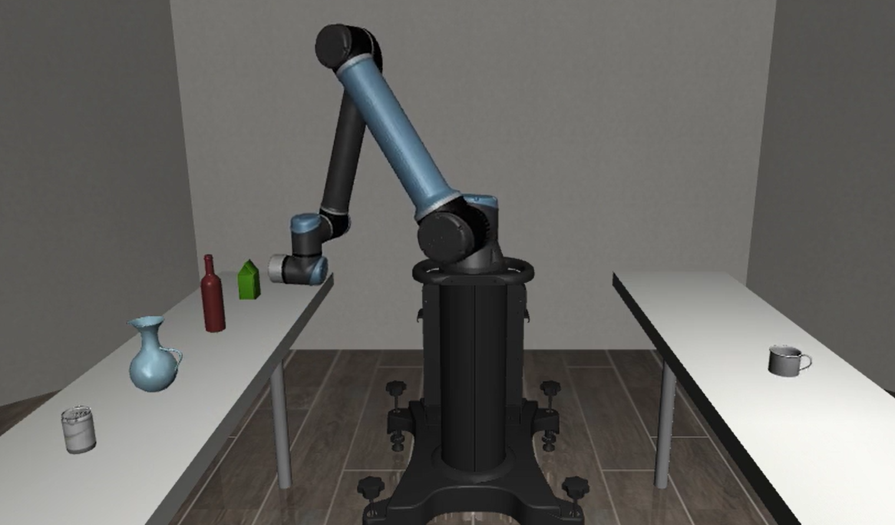

# Robotic-Arm---Multi-Objective-Decision-Analysis
## [[Slide]](https://www.canva.com/design/DAGvc9sjo8s/z4u2r4PJSDfkwV5MqeJ0Yw/view?utm_content=DAGvc9sjo8s&utm_campaign=designshare&utm_medium=link2&utm_source=uniquelinks&utlId=h72de002832#1 "link") 
DualTableTask：雙桌飲品協作任務

這個專案最終希望達成，機器手臂完成一項複雜的抓取與放置任務：

根據不同種類的杯子，選擇並移動正確的飲料到指定位置。

* * *

> `#ed952f`目前進度：可以辨識右方杯子，指向左方對應飲料，成功率54%


 - [x] UR10 模型建置 in robosuite
 - [x] 飲料、杯子模型建置 in robosuite
 - [x] 定義DualTableTask
 - [x] 收集超過800筆數據、訓練BC-RNN模型(成功率54%)
 - [ ] 提升BC-RNN成功率：重新定義rewards、
 - [ ] 更改模型架構：找出成功率高的模型架構
 - [ ] 調整task目標：加上爪夾、將飲料送至右桌
 - [ ] 放到實際手臂上測試：UR10 at NCHC 中群實驗室




---

# 💡 核心功能與特色
1. 動態多目標選擇 (Dynamic Multi-Target Selection)
   
   * 馬克杯任務： 針對馬克杯，機器人有兩種正確的選擇（水壺或綠茶），這強迫代理人學會辨識特定目標，而非盲目抓取。

   * 獎勵塑形： 獎勵函數會特別獎勵代理人明確地朝著正確目標移動，並遠離錯誤的選擇，鼓勵清晰的決策行為。

2. 適應性獎勵與懲罰 (Adaptive Rewards & Penalties)

   * 安全距離懲罰 (Proximity Penalty): 機器人若在沒有完全控制的情況下過於靠近易碎物件，將會受到懲罰，這鼓勵代理人採用更平穩、更受控的接近策略。

3. 增強版穩定性檢查 (Enhanced Stability Check)
   
   * 動態穩定性閾值： 環境會持續追蹤目標飲料的位置變動。如果飲料的移動幅度超過了其自身特性決定的動態閾值（紅酒瓶的閾值會更低），則會被判定為不穩定並給予懲罰。

   * 懲罰機制： 若代理人導致飲料不穩定（過度加速或突然撞擊），會觸發即時懲罰，這對訓練代理人進行平穩抓取和移動至關重要。

---

# 🎮 Requirements
Hardware:

   - 1x SONY DualSense and USB-C cables

Software:

   - Python 3.9

   - Ubuntu 20.04

   - Mujoco dependencies

   - Conda environment

---

# ⚙️ Installation
要在具有 Nvidia GPU 的 Linux機器（Ubuntu 20.04）上安裝 Conda 環境以使用 MuJoCo，需要安裝以下apt套件:
```Bash
$ sudo apt install -y libosmesa6-dev libgl1-mesa-glx libglfw3 patchelf
```

安裝 robosuite conda env
```Bash
$ conda env create -f robomimic_venv_20250822.yml
```

替換 robosuite 為這個 repo 的 robosuite
```Bash
$ cd NCHC_UR10_simulate
$ cp -r /robosuite /home/user/miniconda3/envs/robomimic/lib/python3.9/site-packages
```

安裝 robomimic
```Bash
$ git clone https://github.com/ARISE-Initiative/robomimic.git
$ cd robomimic
$ pip install -e .
```

---

# 🧾 Reference
[[robomimic]](https://robomimic.github.io/ "link") 
